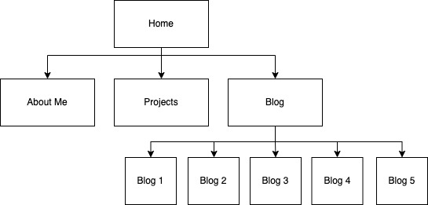
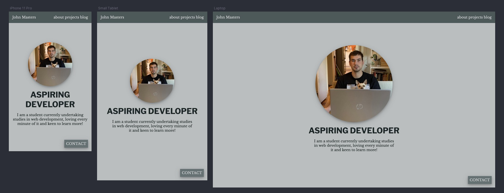
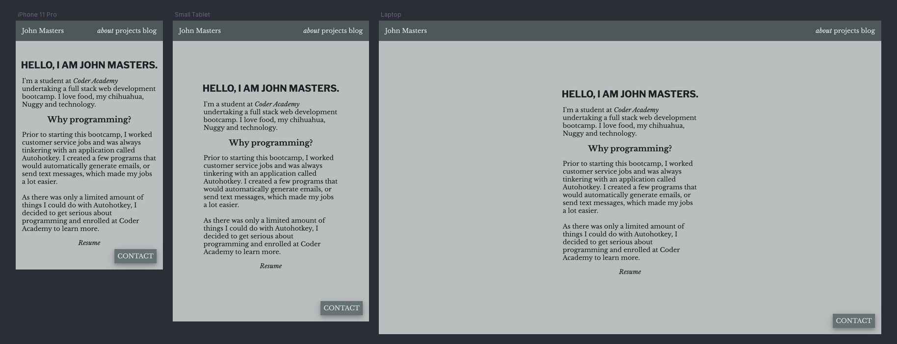
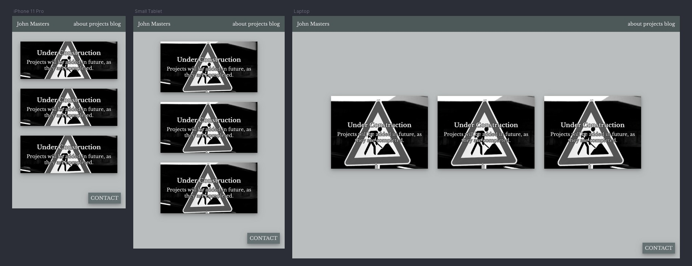
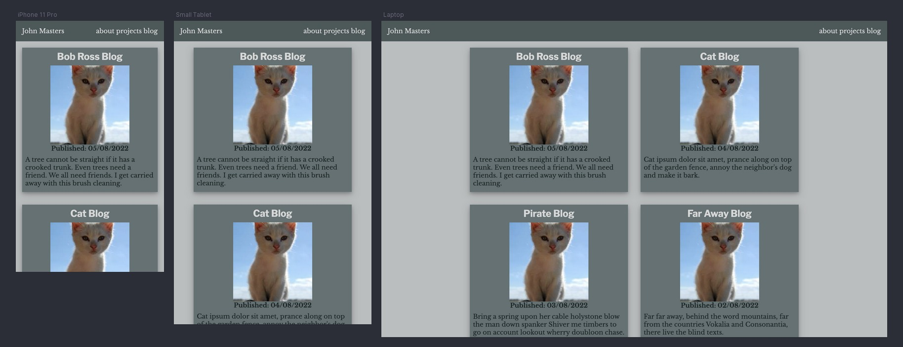
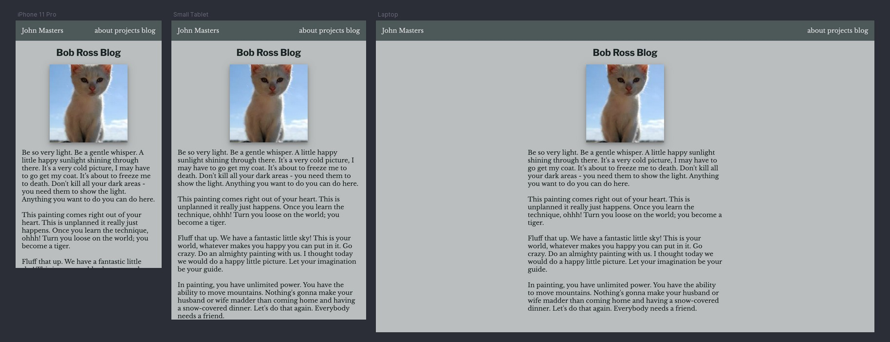

# T1A2 - Porfolio

- [Portfolio Website]("https://inspiring-sopapillas-f0adea.netlify.app/")
- [GitHub Repository]("https://github.com/john-masters/JohnMasters_T1A2")

---

## Purpose

The purpose of my portfolio is to present me as an up and coming developer to prospective employers and showcase my current skills, personality and any projects I'm working on or have finished.

---

## Functionality / features

My portfolio website is coded with semantic HTML elements and optimised for viewing on mobile, tablet and desktop platforms. The site design is kept simple so that it is easy to read and navigate. It is made up of the following 4 pages, and the blog page links to 5 seperate blog pages.

- Index:
The home page of the website features a central image of me, gives a brief introduction and has 3 clear links to other pages and a contact button in the corner which expands to show contact details.

- About:
A short introductory paragraph, introducing myself to the reader. At the bottom, there is a link to my current resume included.

- Projects:
A page with three tiles to fill with future projects as they are developed. Placeholder text advises the reader, that they will be added in future.

- Blog:
Main page for blog posts where the reader has the choice of 5 posts, each one containing unique computer generated placeholder text.

---

## Sitemap

Created with Draw.io

---

## Screenshots

### Index

### About

### Projects

### Blog

### Blog Expanded

---

## Target audience

The target audience for my portfolio is an employer looking to hire a junior developer. I expect them to have an a high-degree of technical knowledge. To ensure ease of viewing, the portfolio will be optimised for mobile, tablet and desktop platforms.

---

## Tech stack (e.g. html, css, deployment platform, etc)

- Website: HTML5, CSS3 and SASS
- Sitemap and wireframes: Diagrams.net
- Deployment: GitHub

---
