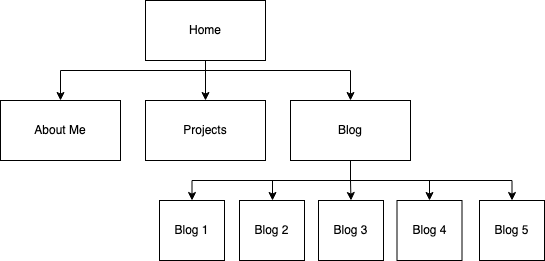

# T1A2 - Porfolio
---
- [Portfolio Website]("")
- [GitHub Repository]("")

## Purpose
---
The purpose of my portfolio is to present me as an up and coming developer to prospective employers and showcase my current skills, personality and any projects I'm working on or have finished.

## Functionality / features
---

## Sitemap
---

## Screenshots
---

## Target audience
---
The target audience for my portfolio is an employer looking to hire a junior developer. I expect them to have an a high-degree of technical knowledge.

In addition, the portfolio will be optimised for mobile, tablet and desktop platforms for ease of viewing on all devices.

## Tech stack (e.g. html, css, deployment platform, etc)
---
- Website: HTML5 and CSS3
- Sitemap and wireframes: Diagrams.net
- Deployment: GitHub